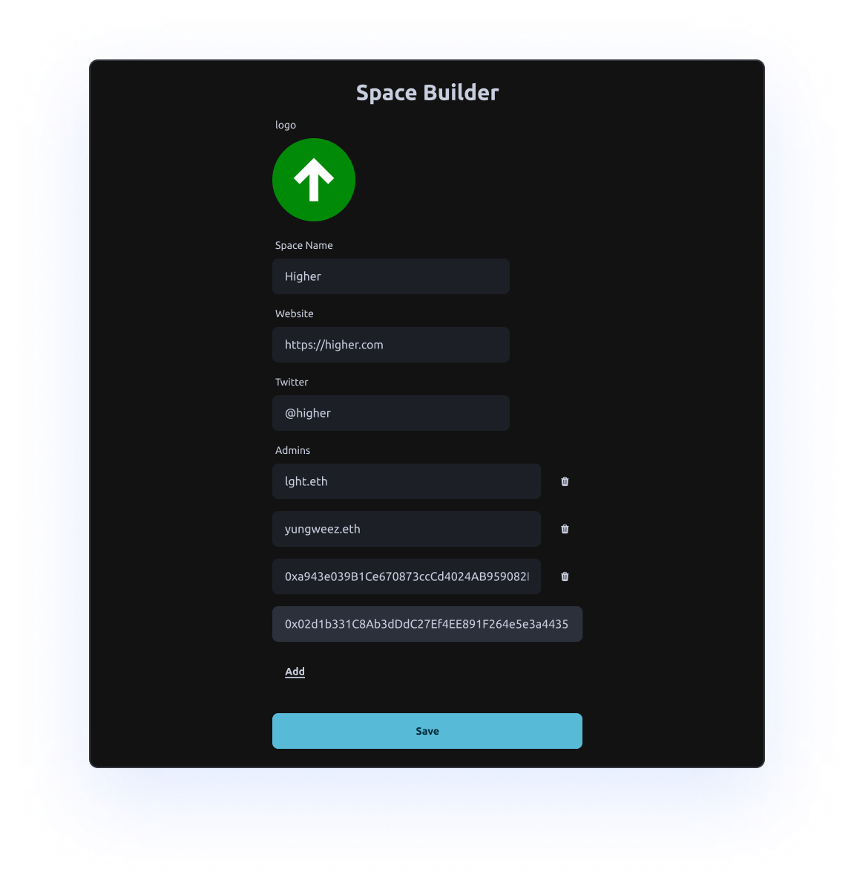

# Creating a Space

This is where community admins will come to set up their organization space.

# Logo

Upload your community logo. Use one that is recognizable in your community.

# Website

Type in website domain

# Twitter Account

Type in space's twitter handle

# Admins

Admins can create contests, mintboards, and moderate posts.

Once signed in your wallet address will automatically be added.

Add other admins wallet addresses / ENS's in your organizations (you can always come back and add them at another time)

